# Balen Taha Nouri

The Balen Taha Nouri is a website for everyone, and mainly for all football lovers. This website will be perfect for all my old clubs, fans and old teammates, of course, for all the new clubs to get to know me as a person. On this page you will find some information about myself, my family and some of the experiences I have got from football. You will find some videos and nice photos of some of my games on this website. And if someone wants to contact me, there is a contact page where you can contact me and I will get back to you.

A live version of the website and the project can be accessed here: [Balen Taha Nouri](https://balennouri.github.io/balen-project1/)

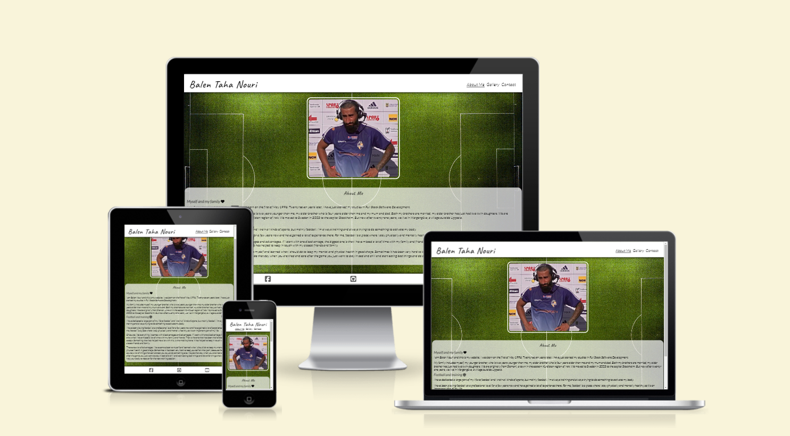

# Table Of Contents

- [Balen Taha Nouri](#balen-taha-nouri)
- [Table Of Contents](#table-of-contents)
- [User Experience Design](#user-experience-design)
  - [User Demographic](#user-demographic)
  - [User Stories](#user-stories)
- [Design](#design)
  - [Colours](#colours)
  - [Typography](#typography)
- [Features](#features)
  - [Existing Features](#existing-features)
    - [Header And Navigation Bar](#header-and-navigation-bar)
    - [Social Media Section](#social-media-section)
    - [About Me (Home Page)](#about-me-home-page)
    - [Gallery Page](#gallery-page)
    - [Contact Page](#contact-page)
    - [Form Submission Page](#form-submission-page)
- [Future Features](#future-features)
- [Technologies Used](#technologies-used)
- [Testing](#testing)
  - [Validator Testing](#validator-testing)
    - [HTML](#html)
    - [CSS](#css)
  - [Lighthouse Testing](#lighthouse-testing)
      - [About Me (Home Page)](#about-me-home-page-1)
      - [Gallery Page](#gallery-page-1)
      - [Contact Page](#contact-page-1)
  - [Known Bugs](#known-bugs)
    - [Solved Bugs](#solved-bugs)
- [Deployment](#deployment)
- [Credit](#credit)
  - [Content And Code](#content-and-code)
  - [Images And Video](#images-and-video)
- [Acknowledgements](#acknowledgements)

# User Experience Design

## User Demographic

This website is ment for:

* Football lovers and people who are interested in training.
* Balen Taha Nouri old clubs and fans and for the new ones aswell.
* For people who know Balen Taha Nouri to get the chance to see how he has managed football life.

## User Stories

As a user of this website:

* I want to read about Balen Taha Nouri.
* I want to see what he has achieved with football.
* I want to get in touch with Balen Taha Nouri and have a chat.

# Design

The goal when the website was designed was that it would be easy to use and that it have a clean layout.

## Colours

The colors used for the website were mainly chosen from the background image that is on all the pages. The background image is a picture of a football pitch from above. The colors are white, black and light white that was used.

## Typography

Google fonts were used to get the right fonts and all the fonts were imported from there. The font of headings on the page has an unik style and was chosen because of the style. It's a fast font and in football speed is an important thing. The font is called Caveat. For the rest of the content on the page, the Lato font was used. In case If the user's browser doesn't read the fonts that are chosen, I put in a second font called Sans-serif for both of them.

# Features

The Balen Taha Nouri website has three pages. All of the pages can be navigated from the navigation bar. The header is fixed, so you can always see the header and the navigation bar when you scroll around the page.

* About me (Home page)
* Gallery
* Contact

## Existing Features

### Header And Navigation Bar

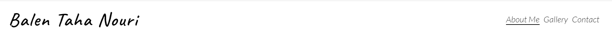

* Featured at the top of the page in the left corner, you will see the page name Balen Taha Nour and that will take you to the About me (Home page) if you click on it.
* In the top right corner there are three other navigation links. About me (Home page), Gallery and Contact.
* The font that is used for the navigation links and the website name is a font called Caveat, and it looks good on the website with the black color.
* When you come on to the website, you easily see the name of the page, and you can easily see the navigation links on the website.
* The header have white background color with the website name and the navigation links in black color
* The header is looking the same across all three pages which enhances usability and consistency.
* The navigation links allow the users move around in the website in an easy and an effective way.

### Social Media Section

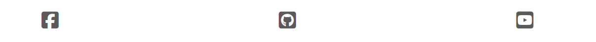

* Down at the bottom of all the pages you have a footer with a white background color and
Three social media logos: Facebook, Github and Youtube that are in black color.
* If you click on one of the social media logos they will navigate to one of my social media accounts depending on which one you click on. This will open in a new tab.

### About Me (Home Page)

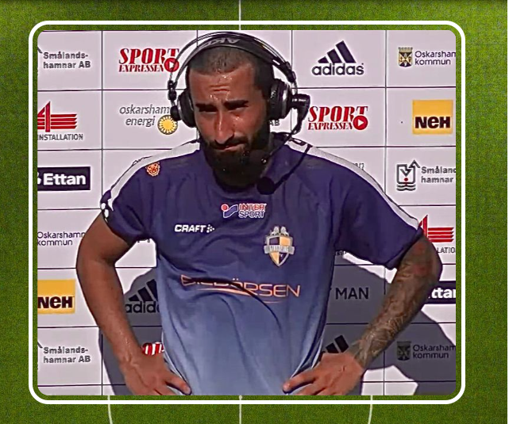

* The first thing you see on the about me page is a picture of myself after a game when I talk with the reporters.

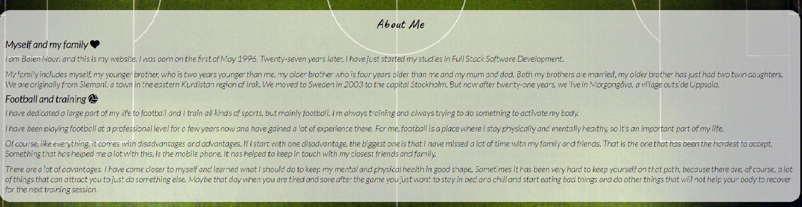

* In the about me section, you can read interesting things from my football experience, about myself, my family and how I have kept my focus on the right things
* To keep the text interesting, it's split into two parts. The first part is about myself and my family and the second part is about football and training.
* The about me section is written in black text with a font of Lato.
* And the text is inside a light white box that has rounded corners, so the readers can easily read the information.

### Gallery Page

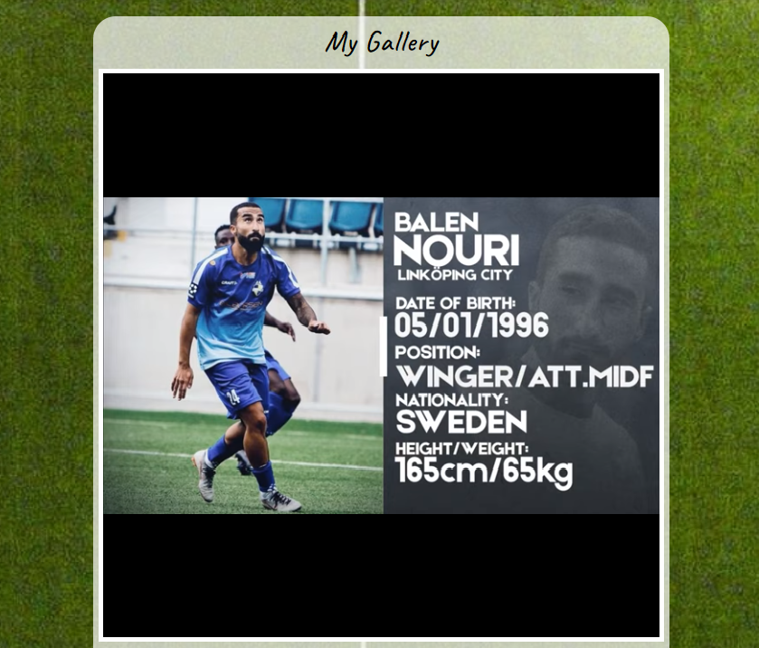

* In the gallery section you can find a video of my football highlights, then you can see some nice pictures of me in some old games i have played.
* The video and the pictures all have a white border around them, so it looks good.
* All the pictures and the video are in a light white box with rounded corners like the about me page, so it is matching with the first page.

### Contact Page

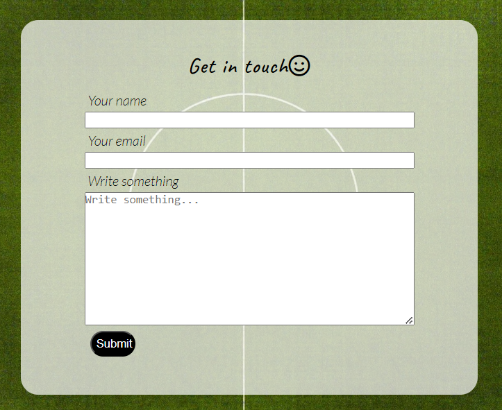

* On the contact page, the users will be able to write to me. By writing down their full name, email and with a message.
* The contact page is valuable for users if they want to ask something or just to get in touch with me.
* ​Like all the other pages, the contact page is also in a light white box, so it matches with the rest of the website.

### Form Submission Page

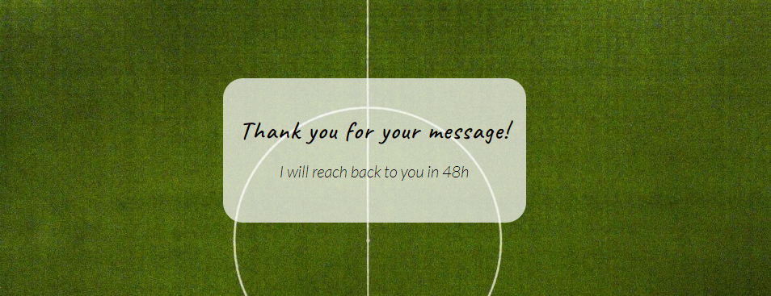

* The submission page is a page that comes if the users write a message to me and send it.
* It is an important page where the user can see that the message has delivered to me and that I will give them an answer in 48 hours.
* When you get the confirmation, after you send me a message, it will also appear in a light white box like the rest of the website.

# Future Features

Future Updates

* More information about myself and training on the About Me page.
* More videos and pictures to the gallery.
* A new page where you can get some training videos and how you can train also.

# Technologies Used

* [HTML](https://en.wikipedia.org/wiki/HTML)
* [CSS](https://en.wikipedia.org/wiki/CSS)
* [Codeanywhere](https://app.codeanywhere.com/)
* [Github](https://github.com/)

# Testing

* I have tested that this page works in different browsers: Chrome, Firefox and Safari.
* I have tested, so the website is responsive, looks good and functions on all standard screen sizes, like a tablet or a phone. I used the devtools device toolbar to see that everything was working.
* I confirmed that the header, navigation, about me, gallery and contact text are easy to read and understand.
* I have tested that the navigation bar works, the contact form where you need to write and email will only accept an email and that the submit button works.

## Validator Testing

### HTML

There was no error found when the website was passed through the official [W3C Validator](https://validator.w3.org/nu/?doc=https%3A%2F%2Fbalennouri.github.io%2Fbalen-project1%2F)

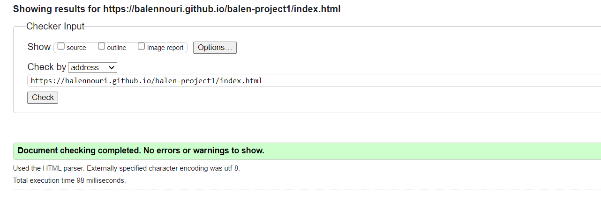

### CSS

There was no error found when the website was passed through the official [W3C Validator](https://jigsaw.w3.org/css-validator/validator?uri=https%3A%2F%2Fbalennouri.github.io%2Fbalen-project1%2F&profile=css3svg&usermedium=all&warning=1&vextwarning=&lang=sv)

## Lighthouse Testing

#### About Me (Home Page)

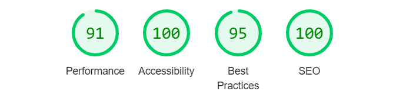

#### Gallery Page

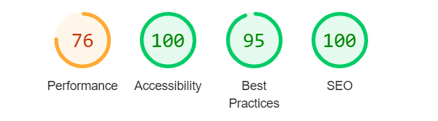

#### Contact Page

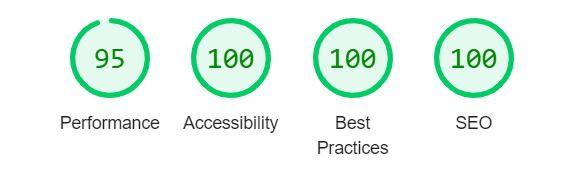

## Known Bugs

### Solved Bugs

All known bugs have been fixed, below is a list of bugs encountered and how they have been fixed.

1. When I first deployed my website to the Github pages, I saw that the images didn't work and that the link was broken to the CSS file. The problem was that I used an absolute file path like you see here:

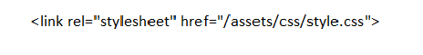

* The solution was to remove the "/" in front of the "assets" like you see here:

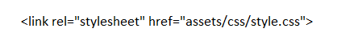

2. I had some other issues like navigating from the different pages on the website to the navigation bar.

* The solution was, I went through the files and change the file paths and that solved the problem.

3. On the W3C validator I got one error on the gallery page where I used frame border for the YouTube video inside the HTML file.

* The solution was to remove it from the HTML file and put it in the CSS file.

# Deployment

The website was deployed to GitHub pages. Here is how you deploy on GitHub:

1. In the GitHub repository, click on the setting tab.
2. On the left side under the code and automation section, click on pages.
3. Set branch as main and click save.
4. The website will deploy after a few minutes. The link will be seen at the top of the page.

The live link can be found here: [Balen Taha Nouri](https://balennouri.github.io/balen-project1/index.html)

# Credit

## Content And Code

* Some of the codes to create the header and the social media links were taken from the CI Love Running project.
* [W3School](https://www.w3schools.com/) was very helpful and helped me with a lot of the codes when I got stuck.
* I find a lot of solutions on [YouTube](https://www.youtube.com/) and that was really good and educational.
* The fonts for the website did I find on [Google Fonts](https://fonts.google.com/)
* The icons used on the about me page, contact page and the social media were taken from [Font Awesome](https://fontawesome.com)
* The screenshot at the top of the ReadMe was built from [Ami Responsive.](https://ui.dev/amiresponsive)
  
## Images And Video

* The football pitch background for all the pages were taken from [Unsplash](https://unsplash.com/@ballaschottner?utm_content=creditCopyText&utm_medium=referral&utm_source=unsplash).
* My highlight video on the gallery page can you find on [YouTube](https://www.youtube.com/watch?v=w843ufMUyaY&ab_channel=%D0%9C%D0%B0%D0%BA%D1%81%D0%B8%D0%BC%D0%9D%D0%B5%D0%BD%D0%BE%D0%B2) and was made by a friend of mine. You can check his channel on the link.
* The other images that were used on the gallery page are taken from private photographers that works for the football clubs I played for.

# Acknowledgements

I would like to thank my mentor David Bowers, the slack community and the Code Institute team.

[Back to top](#balen-taha-nouri)
